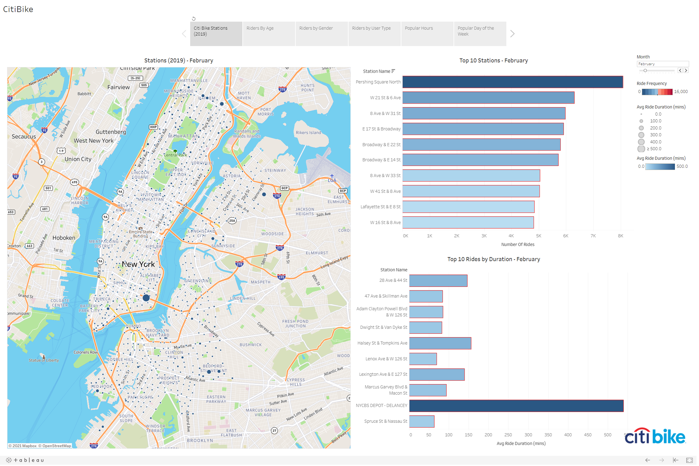
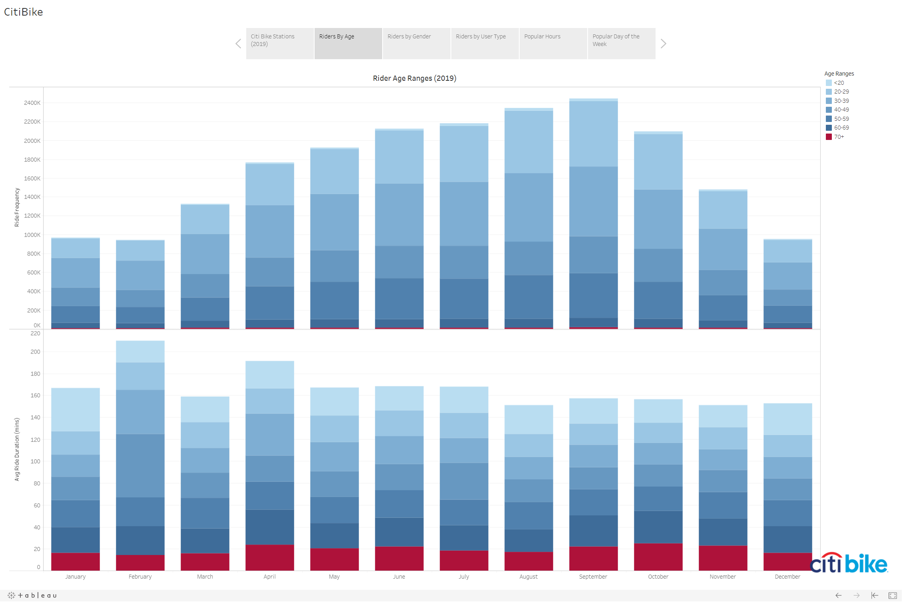
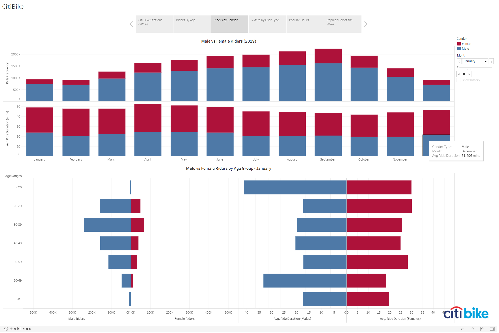
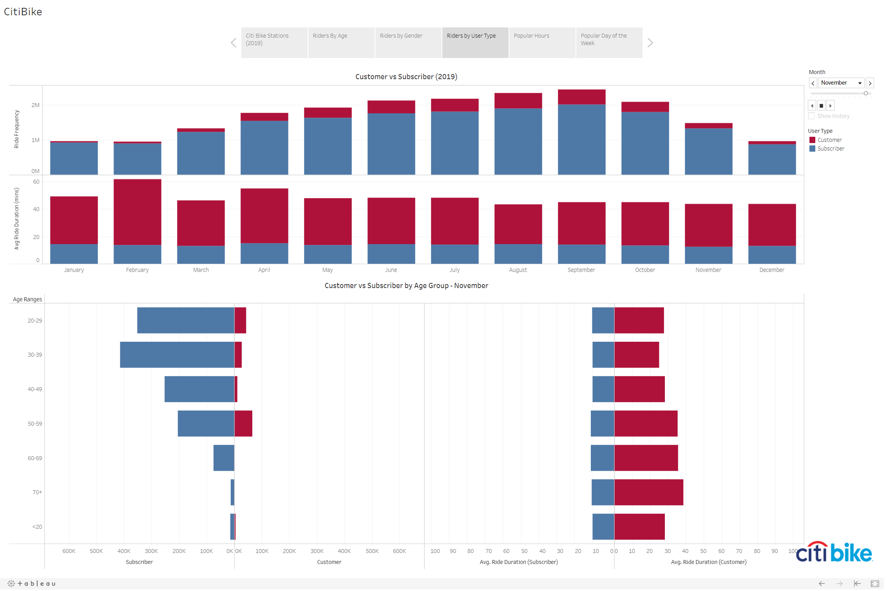
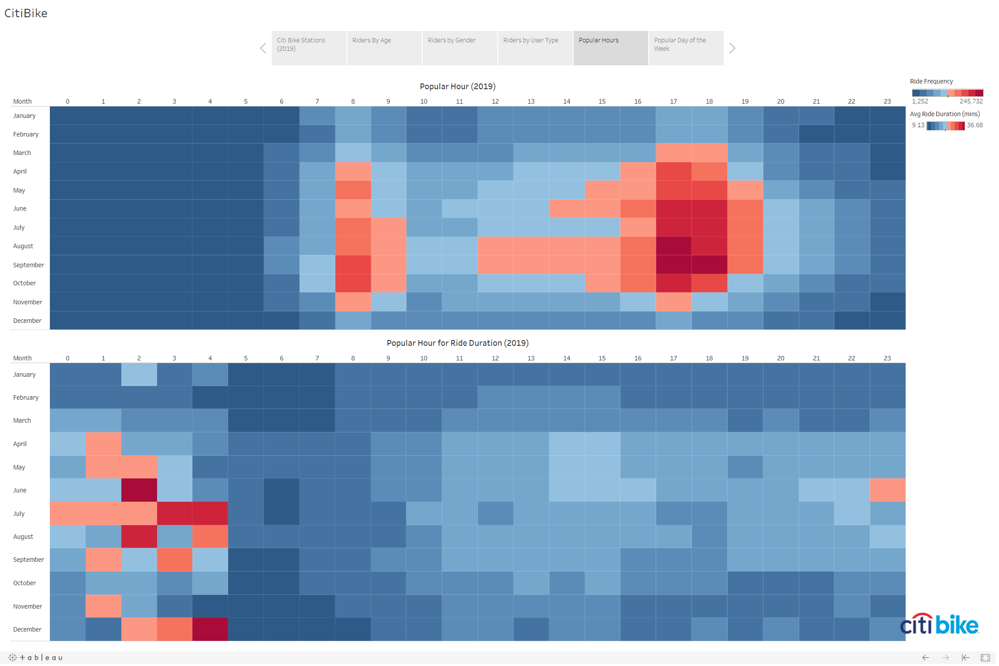
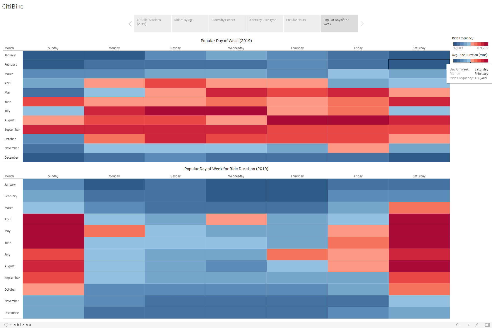

# Citibike Analysis

>  This assignment is to aggregate the data found in the Citi Bike Trip History Logs and find two unexpected phenomena.
Design 2-5 visualizations for each discovered phenomena (4-10 total). You may work with a timespan of your choosing. Optionally, you may merge multiple datasets from different periods.

## Overview
The created visualization looks at CitiBike Trip History logs for the year 2019 in New York City. 

The visualizations review the following:
- Bike usage across stations in New York City to determine the most popular station where bikes are rented and where bikes are rented for the longest duration.
- Ages of riders, identifying who rents the most and what age range rents them longest.
- Male v. Female Riders
- The most popular hours of the day to rent bikes and times when bikes are rented longest.
- The most popular days of the week to rent bikes and days when bikes are rented longest.

## The Tableau Dashboard
[Citi Bike Analysis](https://public.tableau.com/views/SMUProject-CitibikeDashboard/CitiBike?:language=en&:display_count=y&publish=yes&:origin=viz_share_link)

## Data Source
[Citi Bike Data](https://www.citibikenyc.com/system-data)

## Data Cleaning & Processing

- From the data library, all Citibike logs for 2019 for New York City and concetenated all the csvs into one dataframe.
- Next, Converted date columns to datetime objects
- Next, Grouped data by month and station ID to get the top 10 stations per month.
- Created bins for ages [10, 19, 29, 39, 49, 59, 69, 100] and grouped the data by month, age ranges, gender and user type.
- Grouped data by time perameters.
- Created csvs

## Analysis & Findings

### Top Station Performance
The majority of the top bike stations are in the central Manhattan area, with the 2 most popular stations are 'Pershing Square North' and '8 Ave & W 31 ST'. Worth noting that the majority of long duration rides originate from the Brooklyn borough.

### Age Range of Riders
The 20 age group has the lowest amount of riders, despite the fact that they ride for a longer duration on average. The 20-40 age group has the highest number of riders.   

### Riders By Gender
There are more male riders than female riders, though males and females ride durations across age groups.   

### Riders By User Type
Subscribers for bikes use them more than customers, though from a duration standpoint, customers outlast subscribers.  
The largest group of subscribers are in the 30-39 age group, while the largest group of customers are in the 50-59 age group respectively.

### Popular Hours of the Day
More people use bikes during peak office hours. However, bikes are used for a longer period in the early hours of the day.   

### Popular Day of the Week
Weekends have drastically lower riders than weekdays, though the weekend riders use bikes for a longer time. Worth noting the difference between the commuter and the tourist.  

